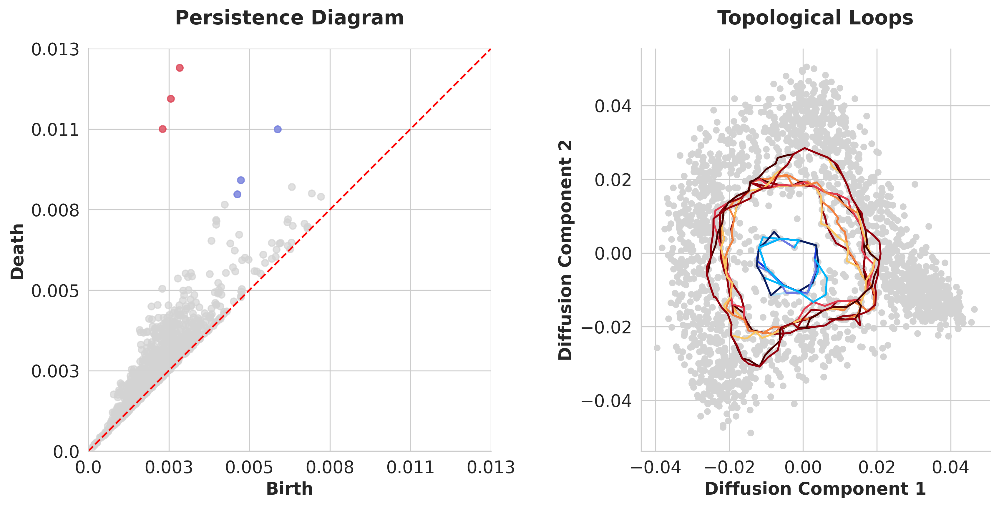

# bioinfoLib
Personal code repo for bioinformatics analysis

## Examples


## External Dependencies
On Linux systems, install additional CUDA dependencies:
```bash
# Install cusparselt (for Linux)
# Download from: https://developer.nvidia.com/cusparselt-downloads
# Install cuDNN
# Download from https://developer.nvidia.com/cudnn-downloads
# Install nccl
# Download from https://developer.nvidia.com/nccl/nccl-download

# on hpc, if cant install those manually, use conda to install them and set env variable to the conda lib folder
conda install nvidia::libcusparse conda-force::nccl nvidia::cuda-toolkit
# then
export LD_LIBRARY_PATH=$CONDA_PREFIX/lib:$LD_LIBRARY_PATH
```
For sksparse, it depends on openblas, so need to make sure both libblas.so.3 and liblapack.so.3 point to the right version of openblas (if system openblas failed, try build from source and configure alternative)

For juila, use 1.12.0-beta1+0.x64.linux.gnu if 1.11 failed due to curl issue.

For rpy2, it needs libtirpc-dev
